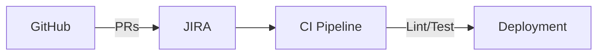
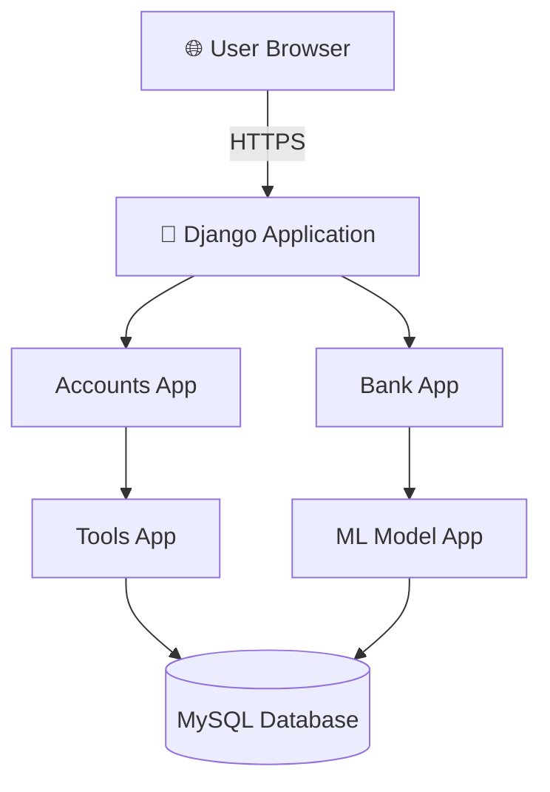
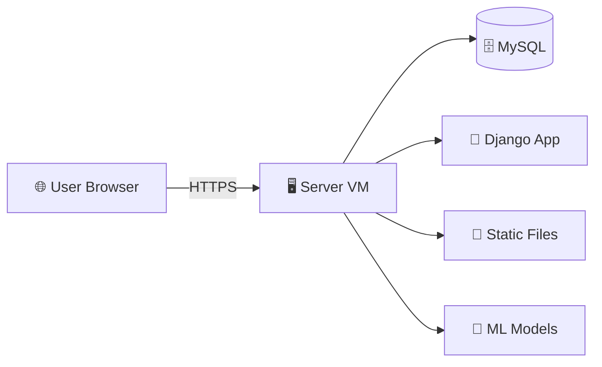
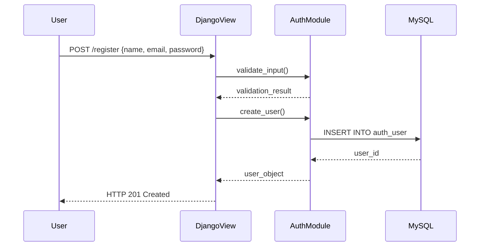
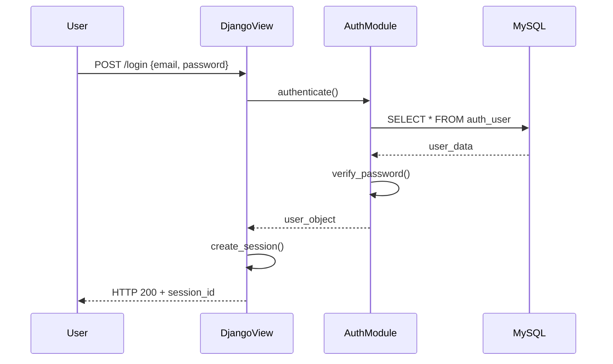
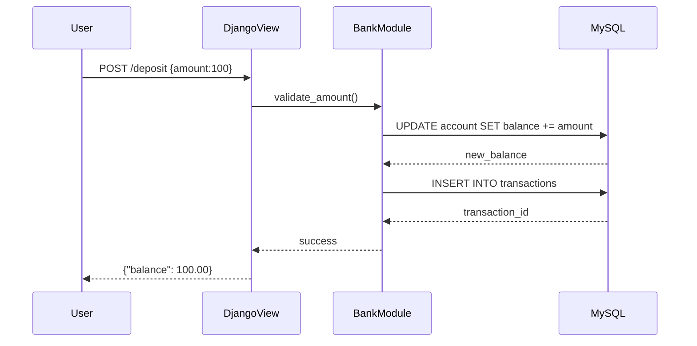
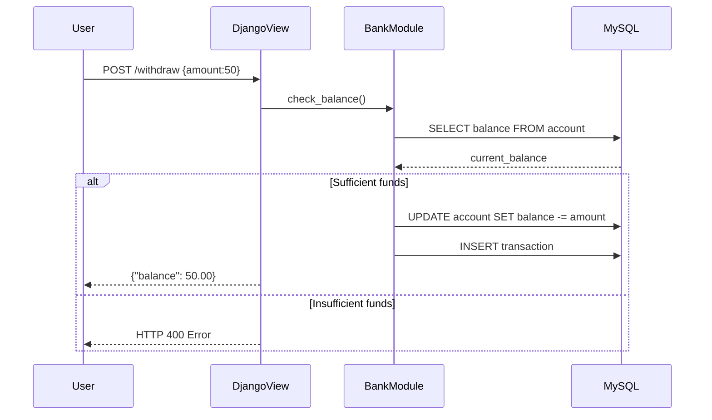
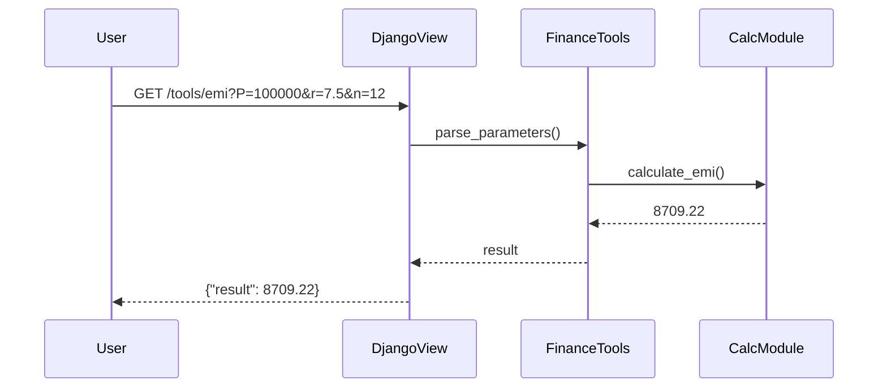
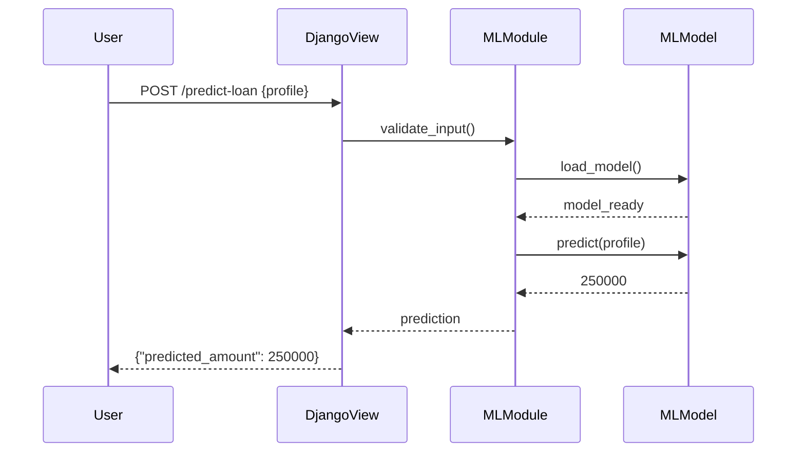

# Online Banking System with Integrated Financial Tools  
**Software Design Document (SDD)**  
*Version 1.0 | Last Updated: 2nd MAY  

## Table of Contents
1. [Introduction & Purpose](#1-introduction--purpose)  
2. [Requirements](#2-requirements)  
3. [Architecture Overview](#3-architecture-overview)  
4. [Data Flow & Sequence Diagrams & Purpose](#4-component-design)  
5. [Security Considerations](#5-security-considerations)  
6. [Deployment & Operations](#6-deployment--operations)  
7. [Testing Strategy](#7-testing-strategy)  
8. [Glossary & References](#8-glossary--references)  

## 1. Introduction & Purpose <a name="1-introduction--purpose"></a>

### 1.1 Project Overview
Web-based platform combining:
- Core banking operations (Account Management)
- 10 financial calculators (EMI, SIP, FD, etc.)
- ML-powered loan estimation

### 1.2 Purpose
| Goal | Description |
|------|-------------|
| User Empowerment | Self-service financial planning tools |
| Operational Efficiency | Unified banking & planning interface |
| Data-Driven Insights | ML-based loan eligibility prediction |

### 1.3 Scope
**In Scope**  
✅ User authentication & session management  
✅ Account operations (balance/deposit/withdraw)  
✅ Financial calculator suite  
✅ ML loan estimator endpoint  

**Out of Scope**  
❌ Funds transfer between users  
❌ Multi-currency support  
❌ Mobile-native app  

## 2. Requirements <a name="2-requirements"></a>

### 2.1 Functional Requirements
**User Authentication**  
```markdown
- Endpoints:
  - `POST /api/register/` {name, email, password}
  - `POST /api/login/` {email, password}
  - `POST /api/logout/`
```

### 2.2 User Registration & Authentication
**Description**: Secure user signup/login/logout functionality

**Endpoints**:
| Method | Endpoint         | Input Parameters        | Responses               |
|--------|------------------|-------------------------|-------------------------|
| POST   | /api/register/   | {name, email, password} | 201 Created/400 BadReq  |
| POST   | /api/login/      | {email, password}       | 200 OK/401 Unauthorized |
| POST   | /api/logout/     | None                    | 204 No Content          |

**Business Rules**:
- Password hashing using PBKDF2
- Unique email validation
- Session/JWT token management

**Acceptance Criteria**:
- Clear error messages for duplicate emails
- Proper session handling for authenticated users

### 2.3 Bank Account Management
**Description**: Core banking operations for authenticated users

**Endpoints**:
| Method | Endpoint              | Input Parameters | Responses               |
|--------|-----------------------|------------------|-------------------------|
| GET    | /api/account/balance/ | None             | {balance: float}        |
| POST   | /api/account/deposit/ | {amount: float}  | New balance             |
| POST   | /api/account/withdraw/| {amount: float}  | New balance/400 BadReq  |

**Business Rules**:
- Positive transaction amounts
- Withdrawal limit ≤ current balance
- Transaction logging with timestamps

**Acceptance Criteria**:
- Atomic balance updates
- Overdraft prevention with errors

### 2.4 Personal Finance Calculators
**Description**: 10 financial planning tools with API endpoints

**Calculator Endpoints**:
```http
GET /api/tools/emi/?P={principal}&r={rate}&n={months}
GET /api/tools/sip/?m={monthly}&r={rate}&n={months}
GET /api/tools/fd/?P={principal}&r={rate}&t={years}
... (8 additional calculators)
```

**Validation Rules**:
- Non-negative numeric inputs
- Rate parameters 0-100%
- SON response format

**Acceptance Criteria**:
- <50ms response time per calculation
- Input validation errors with 400 status

### 2.5 Loan Estimation Service

Endpoint:
```
http
POST /api/predict-loan/
{
  "age": int,
  "monthly_income": float,
  "credit_score": int,
  "loan_tenure_years": int,
  "existing_loan": float,
  "dependents": int
}
```

### 2.6 Testing & Quality Assurance
**Testing Strategy**:

**Unit Tests**:
- ≥2 tests per calculator function
- Banking operation edge cases
- Authentication failure scenarios

**Integration Tests**:
- End-to-end user flows
- Cross-component interactions

**Coverage**:
- ≥80% code coverage
- CI pipeline enforcement

### 2.6 Project Workflow & Tracking
**Development Process**:


### 2.7 Non-Functional Requirements 🔧

### ⚡ Performance 
- **Calculator Functions**: < 50 ms/request under load ⏱️ (🚀 Speed-critical operations)
- **ML Endpoint**: < 100 ms inference time 🧠 (⚡ Real-time predictions)
- **API Response**: < 200 ms (network excluded) 📡 

### 📈 Scalability
- **Stateless API Servers** behind load balancer 🖥️🔄
- **Managed Database** with vertical/horizontal scaling 📦 (☁️ Cloud-native ready)

### 🔒 Security 
- **HTTPS Mandatory** 🔐 (TLS 1.3+ enforced)
- **Auth**: Django sessions/JWT with CSRF protection 🛡️
- **Input Sanitization** 🧼 (XSS/SQLi protection)
- **Data Protection**: PBKDF2 hashing + log masking 🕵️♂️

### ♿ Usability & Accessibility
- **Responsive UI** 📱 (Bootstrap 5 grids)
- **Form Validation** with clear errors ❗🟥
- **WCAG 2.1** compliance (keyboard nav 🔑 + screen reader support 🎧)

### 🧰 Maintainability
- **PEP8 Compliance** 🐍 (flake8 enforced)
- **Modular Architecture** 🧩 (Auth | Banking | Tools | ML apps)
- **Documentation**: Docstrings + inline comments 📘 (70% coverage)

### 🚨 Reliability & Availability
- **99.5% Uptime SLA** 📅 (24/7 monitoring)
- **Auto-Healing**: Health checks + restart policies 💓
- **Disaster Recovery**: Daily backups 🗄️

### 📋 Audit & Logging
- **Critical Ops Logged** 📝 (Auth events 💻, Transactions 💰, Predictions 🤖)
- **Centralized Logging** 🌐 (ELK Stack/CloudWatch)
- **7-Year Retention** 📅 (GDPR compliant)

## 3. Architecture Overview & Purpose <a name="3-architecture-overview"></a>

### 3.1 System Context 


### 3.2 Technology Stack 🛠️
| Layer                | Technology             | Rationale                          |
|----------------------|------------------------|------------------------------------|
| **Language & Framework** | Python 3.9+ & Django 4 | Built-in ORM & Auth 🐍🛡️          |
| **Database**         | MySQL                  | ACID Compliance 🗄️⚖️             |
| **Frontend**         | Bootstrap 5            | Responsive UI 📱💻                |
| **ML Library**       | scikit-learn/XGBoost   | Proven regression models 📈🤖      |
| **Testing**          | pytest                 | Modern testing framework 🧪✅      |
| **Version Control**  | Git + GitHub           | Industry standard PR workflow 🔄👥 |

---

### 3.3 Folder Structure 📂

```bash
project_root/
├── manage.py
├── requirements.txt
├── README.md
├── .gitignore
├── accounts/          # Auth core 🔐
├── bank/              # Banking ops 💳
├── tools/             # Calculators 🧮
├── ml_model/          # AI models 🤖
├── templates/         # UI components 🎨
├── static/            # CSS/JS assets 🖌️
└── tests/             # Testing 
```

### 3.5 Deployment Topology 


## 4. Data Flow & Sequence Diagrams & Purpose <a name="4-component-design"></a>

### 4.1 User Registration

### 4.2 User Login

### 4.3 Deposit Funds


### 4.4 Withdraw Funds


### 4.5 EMI Calculator


### 4.6 Loan Amount Prediction

